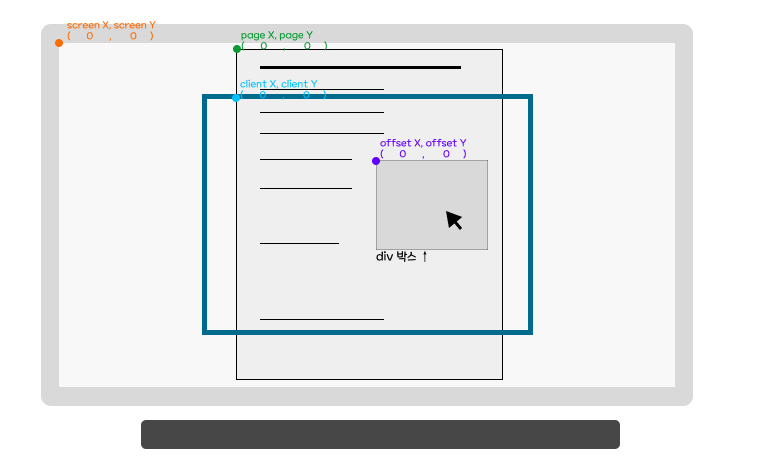

# Mouse Effect

## rewrite
* 클래스를 이용하여 hover 이펙트 추가
* 클릭 시 이펙트를 추가해보려고 했으나 실패
```css
.mouseCursor.mouseClick {background-color: rgba(255, 255, 255, 0.7);}
```
```javascript
let cursor = document.querySelector(".mouseCursor");
document.addEventListener("click", () => {
    cursor.classList.add("mouseClick");
    if (cursor.classList.contains('mouseClick') === true) {
        console.log(cursor.classList.contains('mouseClick'));
        cursor.classList.remove('mouseClick');
    }
});
```

## 참고

* [Coding/javascript/effect at main · Parkhyeonshin/Coding](https://github.com/Parkhyeonshin/Coding/tree/main/javascript/effect)

* [마우스 이펙트 02](https://parkhyeonshin.github.io/Coding/javascript/effect/mouseEffect01.html)

* [dothome1/effect at master · heemwon/dothome1](https://github.com/heemwon/dothome1/tree/master/effect)

* [웹스토리보이](https://heemwon.github.io/dothome1/effect/mouseEffect.html)

* [[자바스크립트 응용]마우스 효과01](https://sshin4882.tistory.com/99)

* [[JavaScript] 마우스를 따라다니는 원 만들기](https://stickode.tistory.com/318)

* [클릭가능한 요소에 따라 변하는 커서 만드는 방법 (mix-blend-mode)](https://seons-dev.tistory.com/entry/커서-만드는법-mix-blend-mode)

* [Interactive한 포트폴리오를 위한 - 마우스커서 애니메이션 만들기(쉬움) HTML,CSS,JS](https://velog.io/@bangina/포트폴리오-꿀팁-마우스커서-애니메이션-만들기쉬움)

## user-select

[user-select - CSS: Cascading Style Sheets | MDN](https://developer.mozilla.org/ko/docs/Web/CSS/user-select)

사용자가 텍스트를 선택할 수 있는지 지정

- `none` : 이 요소와 아래 요소의 텍스트를 선택하지 못하도록 막음. 단, `Selection`객체는 `none`인 요소(와 그 아래)를 포함할 수 있음.

## pointer-events

[pointer-events - CSS: Cascading Style Sheets | MDN](https://developer.mozilla.org/ko/docs/Web/CSS/pointer-events)

## mix-blend-mode

[mix-blend-mode - CSS: Cascading Style Sheets | MDN](https://developer.mozilla.org/ko/docs/Web/CSS/mix-blend-mode)

## backface-visibility

[backface-visibility - CSS: Cascading Style Sheets | MDN](https://developer.mozilla.org/ko/docs/Web/CSS/backface-visibility)

## backdrop-filter

[backdrop-filter - CSS: Cascading Style Sheets | MDN](https://developer.mozilla.org/ko/docs/Web/CSS/backdrop-filter)

## 좌표



| | |
| --- | --- |
| client | 웹페이지가 보여지는 영역을 기준으로함, 스크롤바가 움직이더라도 특정 지점의 x, y는 고정 |
| offset | 좌표를 출력하는 이벤트가 걸려있는 DOM node를 기준으로 함, 위 이미지와 같이 특정 div 영역에서 출력한다면 div의 왼쪽 상단 모서리 부분이 기준점 |
| page | 전체 문서가 기준, 스크롤이 생긴다면 특정 지점의 y좌표값은 페이지가 스크롤될때마다 변경됨 |
| screen | 모니터 화면이기준 |

## Error

### 1. 커서가 마우스 움직임에 따라 움직이지 않음


```jsx
const cursor = document.querySelector("mouseCursor");

        window.addEventListener("mousemove", (e) => {
            cursor.style.left = e.clientX - 25 + "px";
            cursor.style.top = e.clientY - 25 + "px";
        });
```

**[해결]**

```jsx
const cursor = document.querySelector(".mouseCursor");
```

클래스명 앞에 .을 안 찍음

### 2. clientX 외 좌표값이 표시되지 않음


```html
<div class="mouseInfo">
    <ul>
        <li>clientX : <span class="clientX">0</span>px</li>
        <li>clientY : <span class="clientX">0</span>px</li>
        <li>offsetX : <span class="clientX">0</span>px</li>
        <li>offsetY : <span class="clientX">0</span>px</li>
        <li>pageX : <span class="clientX">0</span>px</li>
        <li>pageY : <span class="clientX">0</span>px</li>
        <li>screenX : <span class="clientX">0</span>px</li>
        <li>screenY : <span class="clientX">0</span>px</li>
    </ul>
</div>
```

```jsx
window.addEventListener("mousemove", (e) => {
    document.querySelector(".clientX").innerText = e.clientX;
    document.querySelector(".clientY").innerText = e.clientY;
    document.querySelector(".offsetX").innerText = e.offsetX;
    document.querySelector(".offsetY").innerText = e.offsetY;
    document.querySelector(".pageX").innerText = e.pageX;
    document.querySelector(".pageY").innerText = e.pageY;
    document.querySelector(".screenX").innerText = e.screenX;
    document.querySelector(".screenY").innerText = e.screenY;
});
```

**[해결]**

```html
<div class="mouseInfo">
    <ul>
        <li>clientX : <span class="clientX">0</span>px</li>
        <li>clientY : <span class="clientY">0</span>px</li>
        <li>offsetX : <span class="offsetX">0</span>px</li>
        <li>offsetY : <span class="offsetY">0</span>px</li>
        <li>pageX : <span class="pageX">0</span>px</li>
        <li>pageY : <span class="pageY">0</span>px</li>
        <li>screenX : <span class="screenX">0</span>px</li>
        <li>screenY : <span class="screenY">0</span>px</li>
    </ul>
</div>
```

span의 클래스가 모두 clientX였기 때문에 이외에 클래스는 `document.querySelector`가 찾을 수 없었기 때문에 null이 됨

### 3. mouseover했을 때, 커서 스타일이 변하지 않음


```html
<div class="mouseWrap">
    <p>
        <span class="st1">style1</span>
        <span class="st2">style2</span>
        <span class="st3">style3</span>
    </p>
    <p>
        <span class="st4">style4</span>
        <span class="st5">style5</span>
        <span class="st6">style6</span>
    </p>
</div>
```

```css
.mouseCursor.style1 {background-color: rgba(255, 165, 0, 0.4); border-color: orange;}
.mouseCursor.style2 {background-color: rgba(140, 0, 255, 0.4); border-color: rgb(140, 0, 255); transform: scale(2) rotateX(720deg);}
.mouseCursor.style3 {background-color: rgba(255, 68, 0, 0.4); border-color: snow; transform: scale(1.5) rotateY(180deg);}
.mouseCursor.style4 {background-color: rgba(0, 0, 0, 0.4); border-color: bisque; transform: scale(5) skew(-20deg);}
.mouseCursor.style5 {background-color: rgba(100, 148, 237, 0.4); border-color: lemonchiffon;}
.mouseCursor.style6 {background-color: rgba(250, 128, 114, 0.4); border-color: aquamarine;}
```

```jsx
document.querySelectorAll(".mouseWrap span").forEach((span) => {
    let attr = span.getAttribute("class");

    span.addEventListener("mouseover", () => {
        cursor.classList.add(attr);
    });
    span.addEventListener("mouseout", () => {
        cursor.classList.remove(attr);
    });
});
```

**[해결]**

```html
<div class="mouseWrap">
    <p>
        <span class="st1">style1</span>
        <span class="st2">style2</span>
        <span class="st3">style3</span>
    </p>
    <p>
        <span class="st4">style4</span>
        <span class="st5">style5</span>
        <span class="st6">style6</span>
    </p>
</div>
```

```css
.mouseCursor.st1 {background-color: rgba(255, 165, 0, 0.4); border-color: orange;}
.mouseCursor.st2 {background-color: rgba(140, 0, 255, 0.4); border-color: rgb(140, 0, 255); transform: scale(2) rotateX(720deg);}
.mouseCursor.st3 {background-color: rgba(255, 68, 0, 0.4); border-color: snow; transform: scale(1.5) rotateY(180deg);}
.mouseCursor.st4 {background-color: rgba(0, 0, 0, 0.4); border-color: bisque; transform: scale(5) skew(-20deg);}
.mouseCursor.st5 {background-color: rgba(100, 148, 237, 0.4); border-color: lemonchiffon;}
.mouseCursor.st6 {background-color: rgba(250, 128, 114, 0.4); border-color: aquamarine;}
```

`let attr = *span*.getAttribute("class");` 를 통해 span의 클래스 속성를 가져와 mouseCusor에 클래스를 추가하는데, css에서 mouseCusor의 클래스명이 달랐기 때문에 효과가 적용되지 않음

### 4. mouseover했을 때, cursor: none을 넣어도 원래의 커서가 보임


```css
.mouseCursor.mouseHover {transform: scale(2); background-color: rgba(255, 255, 255, 0.05); border-color: red; backdrop-filter: blur(3px); backdrop-filter: invert(100%); cursor: none;}
```

**[해결]**

```css
.mouseCursor.mouseHover {transform: scale(2); background-color: rgba(255, 255, 255, 0.05); border-color: red; backdrop-filter: blur(3px); backdrop-filter: invert(100%);}
        
.mouseWrap a {font-size: 4vw; text-decoration: none; color: #fff; text-transform: uppercase; font-family: 'Anton', sans-serif; transition: color 0.3s ease-in-out, font-size 0.5s ease-out; cursor: none;}
```

`cursor: none;`은 마우스 호버 클래스가 아니라 그 대상에 넣어야 함

### 5. 커서의 위치가 원의 가운데에 위치하지 않음


```css
.mouseCursor.mouseHover {transform: scale(2); transform-origin: center; background-color: rgba(255, 255, 255, 0.05); border-color: red; backdrop-filter: blur(3px); backdrop-filter: invert(100%);}
```

**[미해결]**

### 6. 마우스가 화면 밖으로 넘어가면 스크롤바가 생김


**[해결]**


```css
body {margin: 0; overflow: hidden;}
```

## Why?


flex-direction: column; 일 때, align-item: center; justify-content: center;


flex-direction: column; 일 때, align-item: center; justify-content: center;


- flex-direction을 column으로 바꿔도 화면에 보여지는 결과는 동일한데 왜 쓴거지